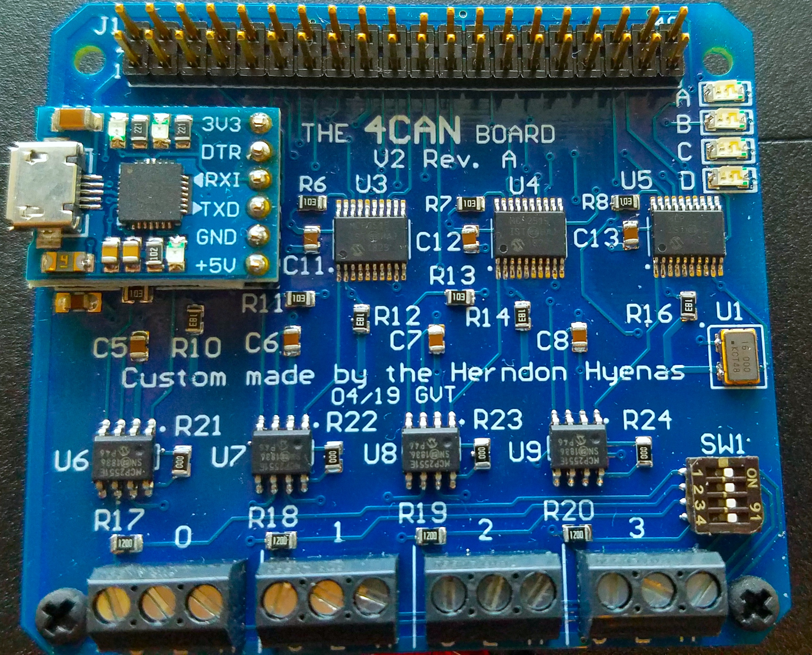
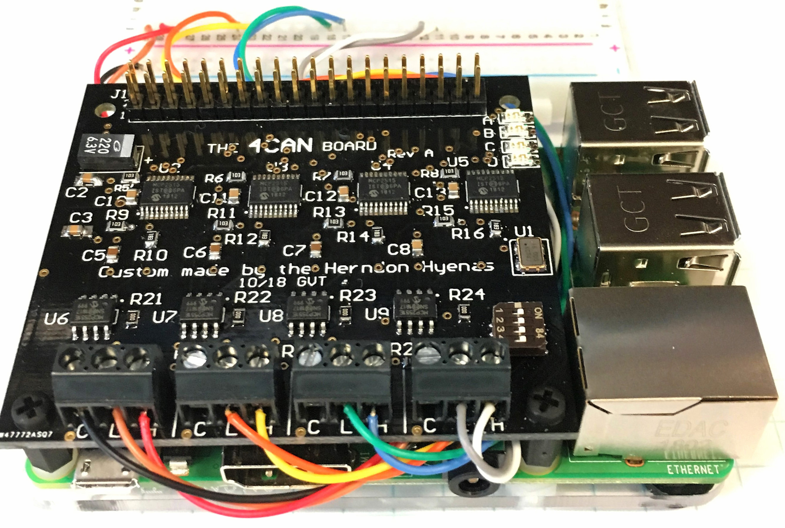
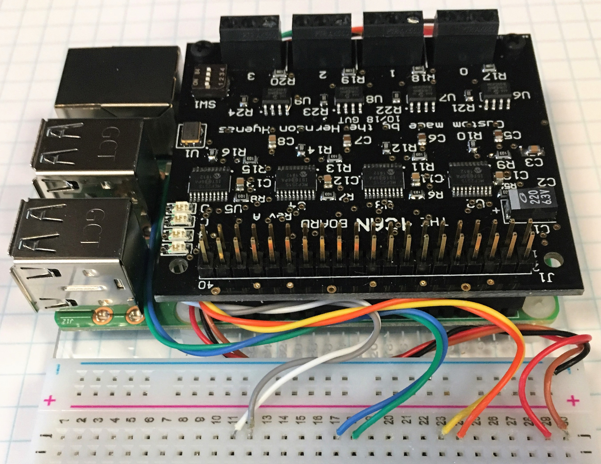

# hardware
Tested on the following raspbian images using a pi3b+
* [Apr 2019 (kernel 4.14.98-v7+)](http://downloads.raspberrypi.org/raspbian_lite/images/raspbian_lite-2019-04-09/)
* [Oct 2018 (kernel 4.14.71-v7+)](http://downloads.raspberrypi.org/raspbian_lite/images/raspbian_lite-2018-10-11/) 
* [Jun 2018 (kernel 4.14.50-v7+)](http://downloads.raspberrypi.org/raspbian_lite/images/raspbian_lite-2018-06-29/)

4can should also work with a pi0w, but it's recommended to use at least a pi3b. Also recommend using a heatsink on the pi, because the pi can get a little toasty running 4 can interfaces.

# install
run the install.sh script (requires sudo) to automatically install everything, and then reboot.

The install script will do the following:

1) Copy the 4 mcp2515-canx.dtbo files to /boot/overlays
```
sudo mkdir /boot/overlays/bak
sudo cp /boot/overlays/mcp2515* /boot/overlays/bak
sudo cp ./dtbo/*.dtbo /boot/overlays
```

2) copy config.txt to /boot/config.txt (make a backup of original /boot/config.txt just incase)
```
sudo cp /boot/config.txt /boot/config.txt.bak
sudo cp config.txt /boot/config.txt
```

# usage
Before using 4can, make sure that the socketcan kernel module is loaded with `sudo modprobe can_dev`. This shouldn't be necessary since the pi will load the correct kernel module based on the device tree, but it doesn't hurt to check.

Once installed, run the 4can.sh to bring up CAN interfaces
`./4can.sh`

wire up the can interfaces and do `candump -acc any` to check they are working.
note: requires can-utils
to install `sudo apt install can-utils`

Note: Sometimes interfaces come up out of order, reboot the pi and that should fix it.
If not, you might have to modify /boot/config.txt. 

# GPIO
The 4can uses a number of GPIO on the raspberry pi. The GPIO pins available for use are
`3, 5, 8, 10, 27, 28, 32, 36` (physical pin numbering)

All the ground pins are tied together and can should be used as ground connections. The 3.3v, and 5v pins can be used to supply voltage as well.

Consult the [schematic](4can_sch.pdf) for more details.

## Recommended Wiring
Remember to connect the external CAN ground to the 4can ground (the "C" connection on the screw terminal). This will ensure good ground integrity and minimize tx/rx errors.

| | |
| -------- | -------- |
|    |   |

When using the 4can with the HyenaPlate, the CAN wires can be routed underneath the pi and connected to the breadboard. This is mainly for aesthetics, but other benefits include not having to constantly screw/unscrew the screw terminals to make new connections, easier troubleshooting, and more stable connections.  

For even more aesthetics, the [resistor color code](https://en.wikipedia.org/wiki/Electronic_color_code) can be used to assign colors to signals.  For example, in the image above:

| interface | CAN-L | CAN-H|
| --------- | --------- | --------- |
| CAN0 | brown | red |
| CAN1 | orange | yellow |
| CAN2 | blue | violet |
| CAN3 | green | white |

black can be used for ground.

# Credit and License
## IndustrialBerry
The 4can was inspired by and is loosely based on the [IndustrialBerry QUAD CAN BUS adapter for Raspberry CanBerry](http://www.industrialberry.com/quad-can-bus-adapter-raspberry-canberry/CanBerry).  Although we modified the design to suit our needs, we must give credit to the fantastic work done by IndustrialBerry. The 4CAN, as well as the IndustrialBerry are licensed under a Creative Commons Attribution Share-Alike license.

## George Tarnovsky
Credit must also be given to George Tarnovsky, for schematic, layout, assembly, and verification!
